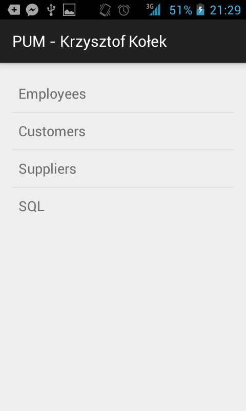
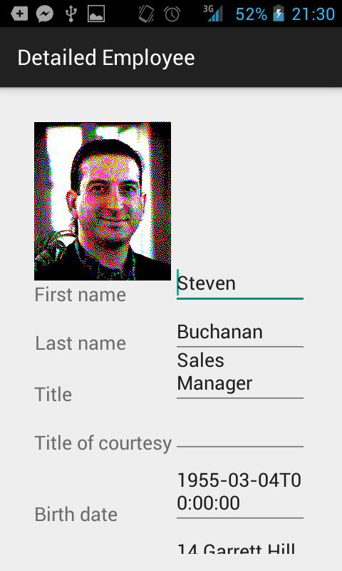
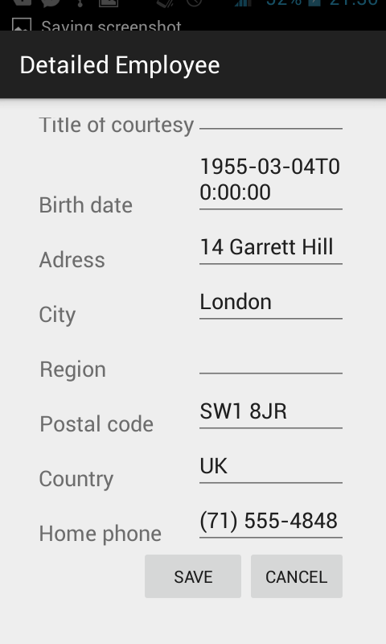
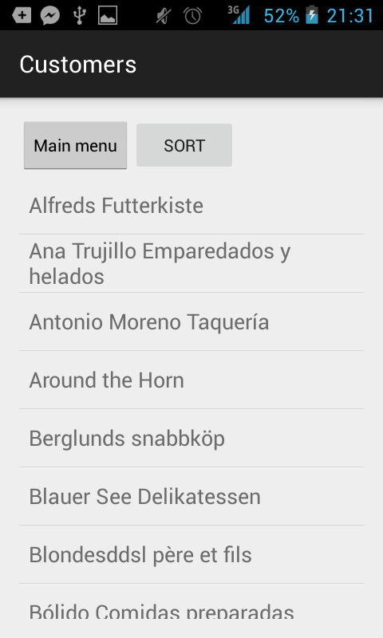
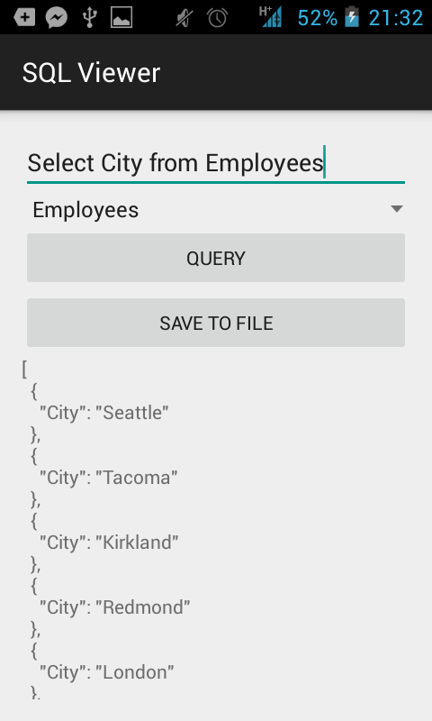
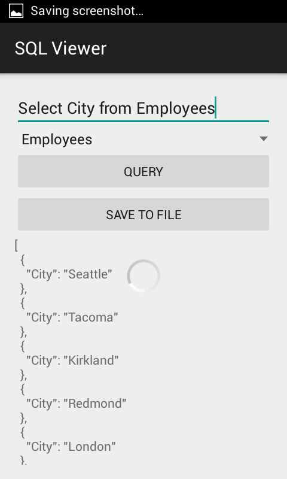
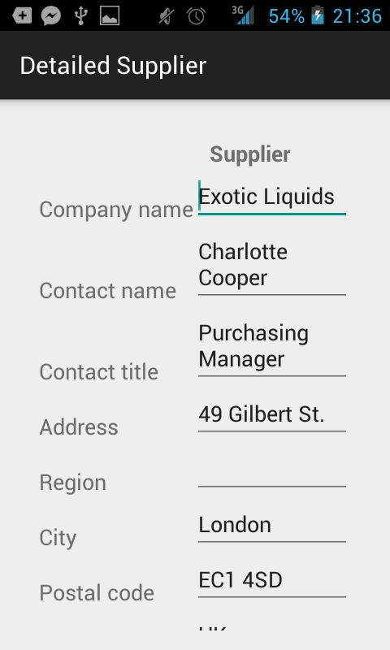
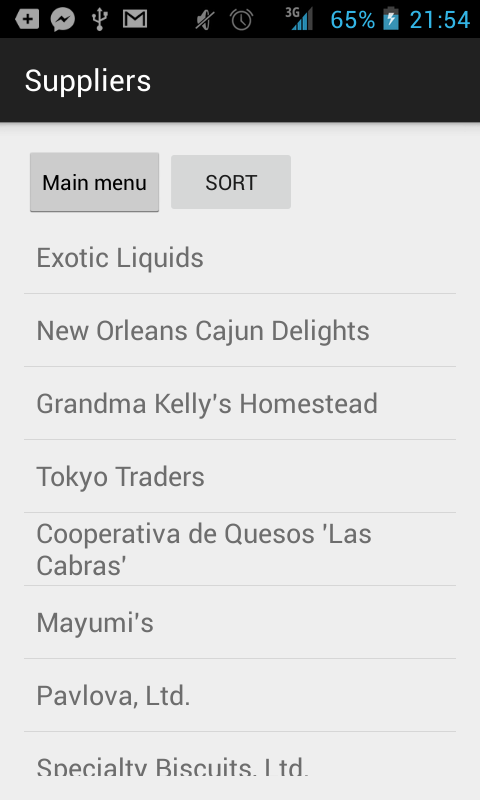

# Northwind android viewer
Only the GUI layer for a separate ***Northwind*** *project*.  It meets the following guidelines:

 - Flexible UI
 - Rest calls

<i class="icon-list"> Goals
------------------------------
**Must have**
 1. Fulfill all guidelines
 2. UI cannot block on retrieving data - spinner

 <i class="icon-ok"> End result
 ------------------------------

 
 
 
 
 
 
 
 
 
